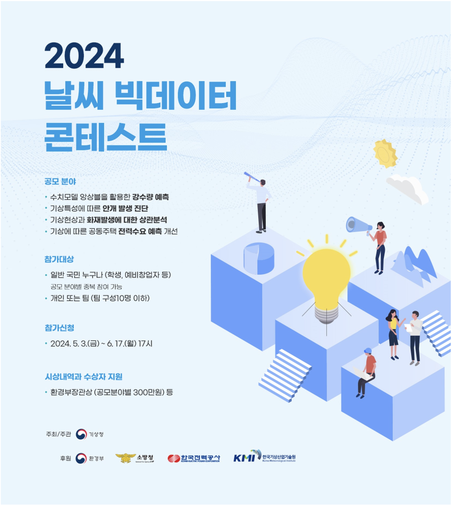

# 2024 날씨 빅데이터 콘테스트

[English Version](README.en.md)

## 주관

- **기상청**

## 기간

- 2024.05.03-2024.08.07

## 참여 및 수상

- **참여 유형**: 팀 참가(5인)

  1. 백엔드 개발자
  2. 임베디드 개발자
  3. 금융 애널리스트
  4. 기상 연구자
  5. 본인

- **결과**:
  - **최우수상** 수상
  - **환경부장관상** 수여
  - **상금**: 300만 원

---

## 대회 개요

### **목표**

- 슈퍼컴퓨터 기반으로 제공된 **강수 확률 데이터**를 활용하여 **최종 강수량 예측 모델** 구축.
- 단순하지만 **해석력과 강력한 성능**을 갖춘 모델을 개발하여 예측 효율성 극대화.

---

## 프로젝트 내용

### **1. 데이터 활용**

- 기상청 슈퍼컴퓨터가 제공한 **강수 확률 데이터**를 기반으로 예측 모델 개발.
- 주요 데이터:
  - 기상 조건별 강수 확률.
  - 과거 시간대의 예측 데이터와 실제 강수량.
  - 강수 패턴에 영향을 미치는 다양한 환경 변수.

---

### **2. 모델 개발**

#### (1) **Time-Weighted 모델 설계**

- 시간 가중치(Time-Weighted)를 활용하여:
  - 최근 데이터에 더 높은 가중치를 부여.
  - 시간 경과에 따른 강수 확률 변화 반영.
- 기상 데이터의 **시간적 특성**을 고려한 예측 모델 개발.

#### (2) **로지스틱 회귀 기반 최종 모델**

- Logistic Regression을 활용하여:
  - 단순하지만 강력한 선형 모델로 **해석 가능한 결과 제공**.
  - 강수 예측 데이터를 기반으로 최종 예측값 생성.
  - 각 시간대별 확률값과 주요 변수 간 관계를 모델링.

#### (3) **모델의 단순성과 성능 조화**

- 예측 데이터의 성격을 반영하여:
  - 지나치게 복잡한 모델을 배제.
  - 간결하지만 신뢰도 높은 예측 결과를 생성.

---

### **3. 보고서 작성 및 발표**

- **보고서**:
  - 모델 설계, 데이터 분석 과정, 예측 결과를 체계적으로 정리.
  - 각 모델의 성능 평가 결과와 개선 가능성을 포함하여 **심사위원들의 이해를 돕는 문서화 작업 수행**.
- **발표**:
  - 최종 보고서를 기반으로 심사위원들에게 모델 논리와 결과 발표.
  - **Time-Weighted와 Logistic Regression의 장점**을 구체적으로 설명.

---

## 주요 성과

### **기술적 기여**

1. **강수 예측 모델 설계**:

   - 기상청 슈퍼컴퓨터 데이터를 기반으로 **시간 가중치**를 적용한 혁신적 모델 개발.
   - 로지스틱 회귀를 활용한 **간단하면서도 효과적인 예측 모델** 구축.

2. **협업을 통한 데이터 융합**:

   - 팀 내 다양한 전문성을 활용하여 **다양한 관점**을 결합한 새로운 접근법 도출.
   - 데이터의 상호 검증 및 분석을 통해 예측 신뢰도 향상.

3. **결과의 해석 가능성 강화**:
   - 복잡한 기상 데이터를 간결하게 해석할 수 있는 예측값 생성.
   - 심사위원과 비전문가도 이해할 수 있는 방식으로 모델 설명.

### **대회 기여**

- 예측 정확도와 단순성을 동시에 만족시키는 모델로 대회에서 높은 평가 획득.
- 기상 데이터 활용 모델의 사회적 활용 가능성을 심사위원들에게 설득.

---

## 평가 결과

- **최우수상 수상**: 강수 예측 모델의 **정확성과 해석력**을 높이 평가받음.
- **환경부장관상 수여**: 단순한 모델 설계로 **실제 활용 가능성**을 인정받음.
